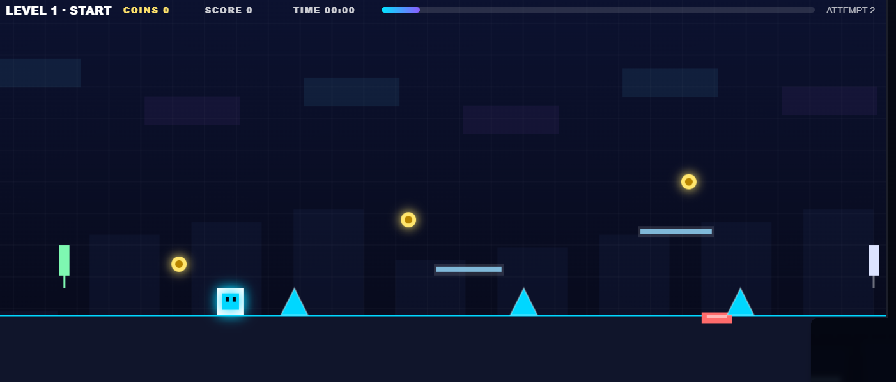
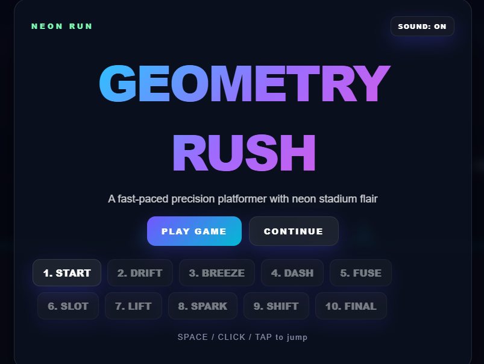

# 🎮 Dreni's Game

<p align="center">
  
</p>

<p align="center">
  <strong>A fast-paced neon arcade platformer built with HTML5 Canvas & JavaScript.</strong>
</p>

<p align="center">
  <a href="#-features">Features</a> •
  <a href="#-gameplay">Gameplay</a> •
  <a href="#-controls">Controls</a> •
  <a href="#-installation">Installation</a> •
  <a href="#-roadmap">Roadmap</a>
</p>

<p align="center">


</p>

---

## ✨ About

**Dreni's Game** is a polished browser-based arcade platformer inspired by the fast, reactive gameplay of classic rhythm platformers.

The game combines **precision movement, neon visuals, hazards, collectibles, checkpoints, moving platforms, jump pads, and level progression** into a lightweight HTML5 experience that runs directly in the browser.

Built as a personal game project, the goal is to create something that feels **fast, responsive, stylish, and fun to replay**.

---

## 🕹️ Gameplay

<p align="center">
  
</p>

The objective is simple:

> **Jump. Dodge. Collect. Survive. Reach the finish.**

Each level introduces new challenges and progressively increases the difficulty.

### 💎 Collect Coins

Collect hidden coins throughout each level to increase your score and reward exploration.

### ⚡ Jump Pads

Use jump pads to launch yourself over difficult obstacles and reach higher platforms.

### 🚧 Avoid Hazards

Spikes and other obstacles require precise timing and quick reactions.

### 🚩 Checkpoints

Reach checkpoints to make difficult sections more forgiving and keep your progress.

### 🏁 Reach the Finish

Survive the entire level and reach the finish line to unlock your next challenge.

---

# 🚀 Features

| Feature                  | Description                                                 |
| ------------------------ | ----------------------------------------------------------- |
| 🎮 **10 Levels**         | Handcrafted levels with progressively increasing difficulty |
| ⚡ **Fast Gameplay**      | Responsive arcade-style movement                            |
| 💎 **Coins**             | Collectibles hidden throughout the levels                   |
| 🚩 **Checkpoints**       | Save progress during difficult sections                     |
| 🟪 **Moving Platforms**  | Dynamic platforming challenges                              |
| 🔺 **Hazards**           | Spikes and environmental obstacles                          |
| 🚀 **Jump Pads**         | Launch across difficult sections                            |
| 💾 **Local Saves**       | Browser-based progression storage                           |
| ⏸️ **Pause System**      | Pause and resume gameplay                                   |
| 🔊 **Synthesized Audio** | Lightweight browser-generated sound effects                 |
| 🗺️ **Level Select**     | Replay previously unlocked levels                           |
| 📱 **Responsive**        | Designed for desktop and touch devices                      |

---

# 🎨 Visual Style

The game uses a **neon cyberpunk arcade aesthetic** featuring:

* 🌌 Dark futuristic backgrounds
* 💜 Neon purple accents
* 💙 Cyan highlights
* 💗 Bright glowing effects
* ✨ Minimalist geometric shapes
* 📐 Grid-based environments
* 🌟 Dynamic visual feedback

<p align="center">
  
  
</p>

---

# 🗺️ Levels

The game currently contains **10 handcrafted levels**.

| #  | Level         | Difficulty |
| -- | ------------- | ---------- |
| 01 | 🌱 Beginner   | ⭐          |
| 02 | ⚡ Pulse       | ⭐⭐         |
| 03 | 💜 Neon       | ⭐⭐         |
| 04 | 🔥 Overdrive  | ⭐⭐⭐        |
| 05 | 🌌 Midnight   | ⭐⭐⭐        |
| 06 | 🚀 Velocity   | ⭐⭐⭐        |
| 07 | 💀 Hazard     | ⭐⭐⭐⭐       |
| 08 | ⚡ Hyperdrive  | ⭐⭐⭐⭐       |
| 09 | 🌠 Eclipse    | ⭐⭐⭐⭐⭐      |
| 10 | 👑 Final Form | ⭐⭐⭐⭐⭐      |

> Difficulty is designed to gradually increase while remaining approachable for casual players.

---

# 🎮 Controls

| Input         | Action         |
| ------------- | -------------- |
| `SPACE`       | Jump           |
| `W`           | Jump           |
| `↑`           | Jump           |
| `Mouse Click` | Jump           |
| `Touch / Tap` | Jump           |
| `ESC`         | Pause / Resume |

### 💡 Tip

Timing is everything.

Don't just react to the obstacle directly in front of you — learn the rhythm of each section and anticipate your next jump.

---

# 📁 Project Structure

```text
geometry-rush/
│
├── index.html
│
├── css/
│   └── game.css
│
├── js/
│   ├── main.js
│   ├── player.js
│   ├── levels.js
│   ├── collision.js
│   └── audio.js
│
├── assets/
│   ├── 1.png
│   ├── 2.png
│   └── 3.png
│
└── README.md
```

### Core Files

**`index.html`**
Main HTML shell and canvas container.

**`css/game.css`**
User interface, menus, animations, colors, and responsive styling.

**`js/main.js`**
Game initialization, main loop, input handling, and runtime orchestration.

**`js/player.js`**
Player movement, jumping, gravity, and player state.

**`js/levels.js`**
Level layouts, obstacles, platforms, coins, and configuration.

**`js/collision.js`**
Collision detection and gameplay physics helpers.

**`js/audio.js`**
Lightweight synthesized sound effects and audio controls.

---

# 💻 Installation

## 1. Clone the repository

```bash
git clone https://github.com/artanphn-dotcom/geometry_dash.git
cd geometry_dash
```

## 2. Run locally

The easiest option is Python's built-in HTTP server:

```bash
python -m http.server 8000
```

Then open:

```text
http://localhost:8000
```

### Or simply open the game

For a basic version of the project, you can also open:

```text
index.html
```

directly in your browser.

---

# 🌐 Browser Support

The game is designed for modern browsers supporting HTML5 Canvas and modern JavaScript.

| Browser         | Support |
| --------------- | ------- |
| Chrome          | ✅       |
| Edge            | ✅       |
| Firefox         | ✅       |
| Safari          | ✅       |
| Mobile browsers | ✅       |

---

# 🧠 Gameplay Design

Dreni's Game is designed around three principles:

### 01 — Easy to Learn

The controls are intentionally simple.

**One button. One objective.**

### 02 — Difficult to Master

As the levels progress, obstacle patterns become more complex and require better timing.

### 03 — Quick Replayability

Levels are short enough to replay repeatedly while still providing enough challenge to encourage improvement.

---

# 📈 Progression System

Your progress is stored locally in the browser.

The progression system allows players to:

```text
Start Game
    ↓
Complete Level
    ↓
Unlock Progress
    ↓
Collect Coins
    ↓
Reach Checkpoints
    ↓
Replay Levels
    ↓
Master The Game
```

---

# 🛠️ Built With

### Core

* HTML5
* JavaScript
* CSS3
* HTML Canvas API

### Design

* CSS animations
* Canvas rendering
* Procedural visual effects
* Responsive UI

### Audio

* Web Audio API
* Lightweight synthesized effects

No large game engine is required.

---

# 🔮 Roadmap

Future improvements planned for the project:

* [ ] 🎵 Music synchronization
* [ ] 🎶 Custom level music
* [ ] 🪙 More collectible types
* [ ] 👤 Character customization
* [ ] 🏆 Achievements
* [ ] 📊 High-score system
* [ ] 🌎 Online leaderboards
* [ ] 🛠️ Built-in level editor
* [ ] 🎨 More player skins
* [ ] 🌈 Additional visual themes
* [ ] 📱 Improved mobile controls
* [ ] 🎮 Gamepad support
* [ ] 💥 More particle effects
* [ ] 🌀 Portals and gravity changes
* [ ] 🧩 Community-created levels

---

# 📸 Screenshots

<p align="center">
  
</p>

<p align="center">
  
  
</p>

---

# 🏆 Credits

**Dreni's Game** was designed and developed as a personal arcade game project.

Built with ❤️, JavaScript, and way too many spikes.

---

# 📄 License

This project is intended for **personal and educational use** unless otherwise specified.

---

<p align="center">

### 🎮 Ready?

**Jump in. Dodge everything. Beat all 10 levels.**

⭐ Star the repository if you enjoyed the project!

</p>
